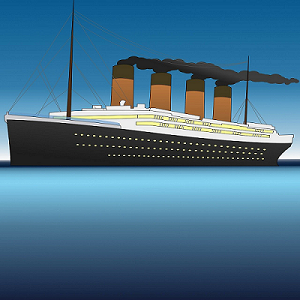

# ~~~ Save the Titanic ~~~

## Description

Let us rewrite history. You are the captain of the legendary *Titanic*. Your aim? You want to manoeuvre the *Titanic* and all its passengers safely and quickly to New York. 

However, it will not be an easy voyage. Icebergs are blocking the way - and hitting them leads to an immediate game over. There are also giant octopuses, which try to slow you down and steal time from you. But you can also make time. To do so, you need to hit islands with coal resources or accelerate, but be warned: Accelerating makes everything move much faster and harder to avoid. 

On the winning page, you can see your final time. Hence, you can always try again to beat yourself in your next run to New York.

## Instructions to play

Use the arrow keys up and down to avoid the obstacles. 
 
The arrow key right will accelerate the *Titanic* for a few seconds. 

## Demo

What are you waiting for? Start playing now: 
 
https://johges.github.io/Save-the-Titanic/ 
